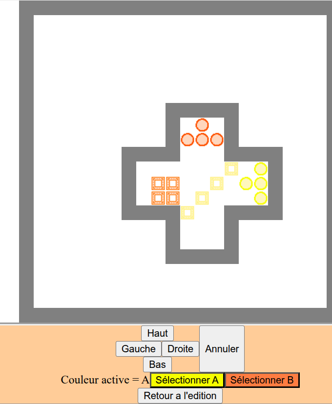
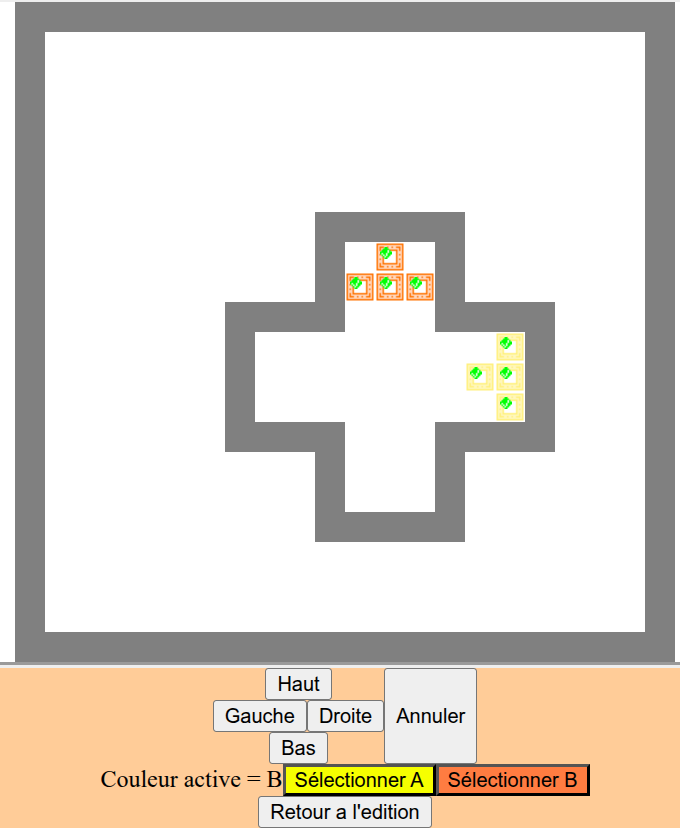

# Présentation

Ceci est un site proposant un jeu de type "casse-tête" à ses utilisateurs.

Mon objectif est de produire un site basé sur les technologies React (pour le front-end) et Django (pour le back-end).

J'ai appelé le jeu "Place to be".

# Place to be

"Place to be" est un jeu de puzzle en grille dans lequel le joueur doit déplacer des blocs stratégiquement afin de leur faire atteindre une position d'arrivée.

  
  

## Règles du jeu

"Place to be" consiste en une série de petits niveaux indépendants. Dans chaque niveau, une situation de départ et d'arrivées sont données, le but est d'atteindre la situation d'arrivée à partir de celle de départ.

Situation de départ : 

* un terrain en 2D consistant en un quadrillage de cases carrées. Celles-ci peuvent être :
  
  * des murs
  
  * des cases vides
  
  * des cases "cibles" de différentes couleurs.

* certains "blocs" situés sur certaines cases de ce terrain. Toutes ont une couleur.

Situation d'arrivée :

* tous les blocs sont sur une case cible de la même couleur. 

Afin d'y arriver, le joueur a à sa disposition des "coups" :

* un coup consiste à déplacer simultanément tous les blocs d'une couleur désirée d'une case vers une direction désirée (haut, bas, gauche, droite)
  
  * si un bloc ainsi déplacé doit arriver sur la case d'un mur, ce bloc ne se déplace pas
  
  * si un bloc ainsi déplacé doit arriver sur la case d'un autre bloc, il le pousse, et ce bloc peut en pousser un autre, etc... sauf si un mur se trouve derrière le dernier bloc en bout de chaîne, auquel cas aucun bloc ne se déplace

* dans la plupart des niveaux, les coups pour chaque couleur sont limités en nombre ; il faut donc être astucieux pour y arriver

* ce jeu étant déterministe, un joueur peut annuler ses derniers coups joués

D'autres règles et types de cases sont prévus et seront implémentés ultérieurement.

# Architecture

Ce projet consiste en deux parties : 

* une partie front-end

* une partie back-end 

## Front-end

Le front-end gère l'affichage du jeu "Place to be", ainsi que l'encryptage et le décryptage des niveaux.

Sont mis en place pour l'heure :

* un éditeur 2D pour créer ses niveaux

* la possibilité de jouer les niveaux ainsi créés (dans un menu directement accessible à partir de l'éditeur)

## Back-end

Pour l'instant, le back-end est rudimentaire. Il consiste en un modèle "User" (en cours de déploiement) et un modèle "Level", ainsi qu'une API régulièrement appelée par le Front pour des opérations CRUD sur les niveaux.

# Etat du projet

:construction: Le projet est actuellement en développement actif.

Les fonctionnalités essentielles sont mis en place pour avoir un contenu jouable, mais certaines fonctionnalités, notamment liées à l'authentification et à la quête principale, seront implémentées prochainement.

# Roadmap

## Authentification

* Création du compte

* Connexion / déconnexion

* Restriction de l'édition de niveaux aux utilisateurs

* Association d'un "numéro" aux niveaux afin de permettre à l'utilisateur d'ordonner ses propres niveaux lui-même

## Quête principale

* Une "quête principale" qui est un ensemble de niveaux auxquels tout le monde pourra jouer, même les utilisateurs non connectés
- Plusieurs dizaines de niveaux

- Possibilité de passer un niveau jugé trop difficile

- Des tool-tips dans les premiers niveaux
